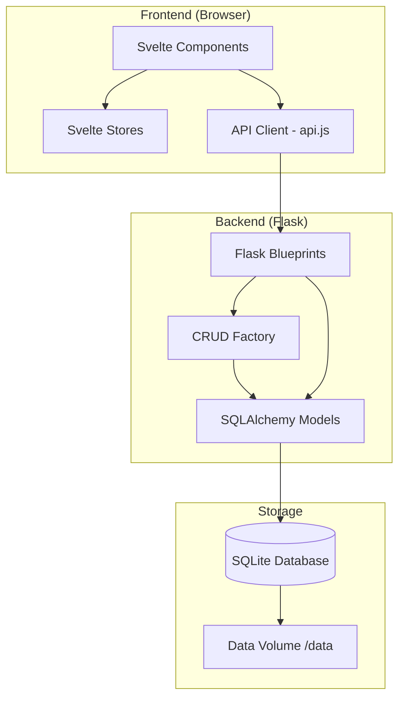
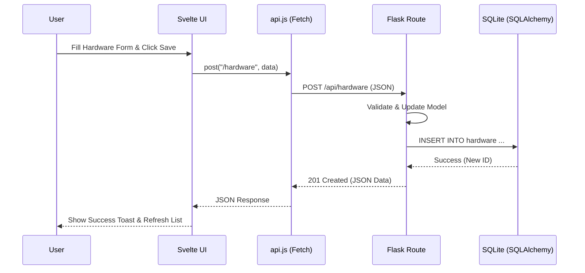

# Reverse Engineering: Homelab Hub

This document provides a technical overview of the original repository, detailing its architecture, components, data flow, and dependencies.

## 1. Architecture Overview

Homelab Hub follows a standard client-server architecture, designed for lightweight deployment and ease of use in a homelab environment.

- **Frontend**: A Single Page Application (SPA) built with **Svelte** and **Vite**. It provides a reactive user interface for managing homelab inventory, documentation, and network visualization.
- **Backend**: A RESTful API built with **Flask** (Python). It handles business logic, database interactions via **SQLAlchemy**, and serves the frontend assets in production.
- **Database**: Uses **SQLite** by default, stored as a local file. This simplifies deployment and backups for homelab users.
- **Deployment**: Containerized using **Docker**. The `Dockerfile` uses a multi-stage build to compile the frontend and package it with the Python backend into a single image.

## 2. Component Diagram



## 3. Data Flow Diagram

```mermaid
dfd2
    title Data Flow for Homelab Hub

    User((User))
    Frontend[Frontend SPA]
    Backend[Flask API]
    Database[(SQLite DB)]

    User -> Frontend: Interacts with UI
    Frontend -> Backend: REST API Request (JSON)
    Backend -> Database: SQL Query (SQLAlchemy)
    Database -> Backend: Result Set
    Backend -> Frontend: JSON Response
    Frontend -> User: Updates UI
```

## 4. Database Schema

The database consists of several tables representing homelab entities and their relationships.

### Major Tables

- **hardware**: Physical machines (servers, PCs).
  - `id`, `name`, `hostname`, `ip_address`, `mac_address`, `cpu`, `ram_gb`, `os`, `make`, `model`, etc.
- **vms**: Virtual machines running on hardware.
  - `id`, `hardware_id` (FK), `name`, `hostname`, `ip_address`, `os`, `cpu_cores`, `ram_gb`, `disk_gb`, etc.
- **apps**: Applications or services.
  - `id`, `hardware_id` (FK) OR `vm_id` (FK), `name`, `description`, `ip_address`, `port`, `https`, etc.
- **storage**: Storage pools or drives.
  - `id`, `hardware_id` (FK) OR `vm_id` (FK), `name`, `storage_type`, `raid_type`, `usable_space_tb`, etc.
- **shares**: Network shares (SMB, NFS).
  - `id`, `storage_id` (FK), `name`, `share_type`, `hostname`, `ip`.
- **networks**: Network definitions.
  - `id`, `name`, `vlan_id`, `subnet`, `gateway`, `color`.
- **network_members**: Junction table linking entities to networks.
  - `id`, `network_id` (FK), `member_type` (hardware/vm/app/misc), `member_id`, `ip_on_network`.
- **documents**: Markdown documentation.
  - `id`, `parent_id` (FK - self), `title`, `content`, `sort_order`.
- **misc**: Miscellaneous hardware (switches, IoT).
- **map_layout**: Stores coordinates for the network map visualization.
- **relationships**: Custom defined links between entities.

## 5. API Endpoints

The API is organized into blueprints, most of which provide standard CRUD operations via a factory.

### Inventory & System

- `GET /api/health`: System health check.
- `GET /api/inventory`: Get all inventory items.
- `GET /api/inventory/search?q=...`: Search across all entities.
- `GET /api/inventory/export`: Export entire database as JSON.
- `POST /api/inventory/import`: Import database from JSON.

### Resource CRUD (Standard Endpoints)

Available for: `/api/hardware`, `/api/vms`, `/api/apps`, `/api/storage`, `/api/shares`, `/api/networks`, `/api/misc`, `/api/documents`.

- `GET /api/{resource}`: List all.
- `GET /api/{resource}/{id}`: Get details.
- `POST /api/{resource}`: Create new.
- `PUT /api/{resource}/{id}`: Update existing.
- `DELETE /api/{resource}/{id}`: Remove.

### Map & Relationships

- `GET /api/map/layout`: Get node positions.
- `POST /api/map/layout`: Save node positions.
- `GET /api/map/relationships`: Get custom edges.

## 6. External Dependencies

### Backend (Python/Flask)

- `flask`: Web framework.
- `flask-sqlalchemy`: ORM.
- `flask-cors`: Cross-Origin Resource Sharing.
- `alembic`: Database migrations.
- `gunicorn`: Production WSGI server.

### Frontend (JS/Svelte)

- `svelte`: UI framework.
- `vite`: Build tool.
- `cytoscape`: Graph library for the network map.
- `bytemd`: Markdown editor component.
- `svelte-spa-router`: Client-side routing.

## 7. Configuration Requirements

Configuration is handled primarily through environment variables and a Python config class.

- **`DATABASE_URL`**: Connection string for the database. Defaults to `sqlite:///data/homelab-hub.db`.
- **`FLASK_ENV`**: Set to `production` in Docker.
- **`MAX_CONTENT_LENGTH`**: Defaults to 5MB to allow for image uploads in markdown/icons.
- **Port**: The application listens on port `8000` by default.

---

## Folder and File Purpose

- **`backend/`**: Contains the Flask application.
  - **`app/`**: Core application logic.
    - **`models/`**: SQLAlchemy database models.
    - **`routes/`**: API endpoint definitions.
    - **`utils/`**: Helper functions.
  - **`migrations/`**: Alembic database migration scripts.
  - **`requirements.txt`**: Python dependencies.
  - **`wsgi.py`**: Entry point for Gunicorn.
- **`frontend/`**: Contains the Svelte application.
  - **`src/`**: Source code.
    - **`components/`**: Reusable Svelte components (Forms, Map, Layout).
    - **`lib/`**: Shared logic (API client, stores).
    - **`pages/`**: Main view components (Inventory, Map, Docs).
  - **`package.json`**: Frontend dependencies and scripts.
- **`data/`**: Default location for the SQLite database (mounted as a volume in Docker).
- **`docs/`**: Project documentation.
- **`Dockerfile`**: Instructions for building the unified container image.
- **`docker-compose.yml`**: Recommended deployment configuration.

---

## User Request Sequence Diagram

This diagram shows how a request (e.g., creating a new Hardware item) flows through the system.


